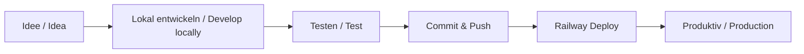

# Feature Development Workflow

Kompletter Workflow von der Idee bis zum Railway Deployment.

Complete workflow from idea to Railway deployment.

---

## 🎯 Workflow Übersicht / Workflow Overview



---

## 📋 Schritt-für-Schritt Guide

### Phase 1: Vorbereitung / Preparation

#### 1. Feature planen

**Fragen klären:**
- [ ] Was soll das Feature machen?
- [ ] Ist es Frontend, Backend oder Full-Stack?
- [ ] Welche Datenbank-Änderungen sind nötig?
- [ ] Welche GraphQL Queries/Mutations werden benötigt?
- [ ] Welche UI-Komponenten werden benötigt?

**Beispiel:**
```
Feature: Dark Mode Toggle
Type: Full-Stack (Frontend + Backend)
Database: Neue User Preference Spalte
GraphQL: updateUserPreference Mutation
UI: Toggle Component in Settings
```

---

#### 2. Issue/Task erstellen (optional)

Erstelle ein GitHub Issue oder Task-Ticket:

```markdown
## Feature: Dark Mode Toggle

### Description
Nutzer sollen zwischen Light und Dark Mode wechseln können.

### Tasks
- [ ] Backend: User Preference Model erweitern
- [ ] Backend: GraphQL Mutation für Theme Update
- [ ] Frontend: Dark Mode Theme in Emotion
- [ ] Frontend: Toggle Component
- [ ] Frontend: Preference aus API laden
- [ ] Tests: Unit + Integration Tests

### Acceptance Criteria
- Nutzer kann Dark Mode aktivieren
- Preference wird gespeichert
- Nach Reload bleibt Preference erhalten
```

---

### Phase 2: Lokale Entwicklung / Local Development

#### 1. Development Environment starten

```bash
# Docker Services starten (DB + Redis)
cd packages/twenty-docker
docker-compose up -d db redis

# Zurück zum Root
cd ../..

# Development Server starten
yarn start
```

---

#### 2. Feature Branch erstellen

```bash
# Von main branchen
git checkout main
git pull origin main

# Feature Branch erstellen
git checkout -b feature/dark-mode-toggle

# Oder für Bug Fixes
git checkout -b fix/theme-persistence-bug
```

---

#### 3. Backend entwickeln (falls nötig)

**Schritt 3a: Datenbank Schema ändern**

```bash
# 1. Entity in TypeORM anpassen
# Beispiel: packages/twenty-server/src/engine/core-modules/user/user.entity.ts

# 2. Migration generieren
npx nx run twenty-server:typeorm migration:generate \
  src/database/typeorm/core/migrations/common/AddUserThemePreference \
  -d src/database/typeorm/core/core.datasource.ts

# 3. Migration ausführen
npx nx run twenty-server:typeorm migration:run

# 4. Metadata synchronisieren
npx nx run twenty-server:command workspace:sync-metadata
```

**Schritt 3b: GraphQL Resolver/Service erstellen**

```typescript
// packages/twenty-server/src/engine/core-modules/user/user.resolver.ts

@Mutation(() => User)
async updateUserTheme(
  @Args('theme') theme: 'light' | 'dark',
  @AuthUser() user: User,
): Promise<User> {
  return this.userService.updateTheme(user.id, theme);
}
```

**Schritt 3c: Backend testen**

```bash
# Unit Tests
npx nx test twenty-server

# Integration Tests
npx nx run twenty-server:test:integration:with-db-reset

# GraphQL Playground öffnen
# http://localhost:3000/graphql
```

---

#### 4. Frontend entwickeln (falls nötig)

**Schritt 4a: GraphQL Types generieren**

```bash
# Nach Backend-Änderungen
npx nx run twenty-front:graphql:generate
```

**Schritt 4b: UI-Komponente erstellen**

```typescript
// packages/twenty-front/src/components/ThemeToggle.tsx

import styled from '@emotion/styled';
import { useRecoilState } from 'recoil';
import { themeState } from '@/states/themeState';

export const ThemeToggle = () => {
  const [theme, setTheme] = useRecoilState(themeState);

  const handleToggle = () => {
    const newTheme = theme === 'light' ? 'dark' : 'light';
    setTheme(newTheme);
    // API call to persist
  };

  return (
    <StyledToggle onClick={handleToggle}>
      {theme === 'light' ? '🌙' : '☀️'}
    </StyledToggle>
  );
};

const StyledToggle = styled.button`
  padding: ${({ theme }) => theme.spacing(2)};
  background: ${({ theme }) => theme.background.primary};
  border: none;
  cursor: pointer;
`;
```

**Schritt 4c: Storybook Story erstellen**

```typescript
// packages/twenty-front/src/components/ThemeToggle.stories.tsx

import type { Meta, StoryObj } from '@storybook/react';
import { ThemeToggle } from './ThemeToggle';

const meta: Meta<typeof ThemeToggle> = {
  title: 'Components/ThemeToggle',
  component: ThemeToggle,
};

export default meta;
type Story = StoryObj<typeof ThemeToggle>;

export const Light: Story = {};
export const Dark: Story = {};
```

**Schritt 4d: Frontend testen**

```bash
# Storybook starten (Component Development)
npx nx storybook:dev twenty-front

# Unit Tests
npx nx test twenty-front

# Storybook Tests
npx nx storybook:build twenty-front
npx nx storybook:serve-and-test:static twenty-front
```

---

### Phase 3: Testing & Quality / Testing & Quality

#### 1. Automatische Checks

```bash
# Linting (mit Auto-Fix)
npx nx lint twenty-front --fix
npx nx lint twenty-server --fix

# Type Checking
npx nx typecheck twenty-front
npx nx typecheck twenty-server

# Unit Tests
npx nx test twenty-front
npx nx test twenty-server

# Integration Tests (Backend)
npx nx run twenty-server:test:integration:with-db-reset
```

---

#### 2. Manuelles Testing

**Im Browser testen:**
```bash
# Dev Server sollte laufen
yarn start

# Browser öffnen
open http://localhost:3001

# Test Checklist:
# ✓ Feature funktioniert wie erwartet
# ✓ Keine Console Errors
# ✓ Responsive Design (verschiedene Bildschirmgrößen)
# ✓ Accessibility (Keyboard Navigation, Screen Reader)
# ✓ Performance (keine Lags)
```

**GraphQL Playground:**
```bash
# GraphQL Playground öffnen
open http://localhost:3000/graphql

# Mutation testen
mutation {
  updateUserTheme(theme: "dark") {
    id
    theme
  }
}
```

---

#### 3. Edge Cases testen

- [ ] Leere Daten / Empty data
- [ ] Sehr lange Strings / Very long strings
- [ ] Spezielle Zeichen / Special characters
- [ ] Fehlerhafte API Responses / Error responses
- [ ] Offline Modus / Offline mode
- [ ] Langsame Verbindung / Slow connection

---

### Phase 4: Code Review & Cleanup

#### 1. Code Quality Check

**Checklist:**
- [ ] Keine `console.log()` Statements vergessen
- [ ] Keine `any` Types verwendet
- [ ] Keine hardcoded Werte (nutze Constants)
- [ ] Comments nur wo nötig
- [ ] Keine unused Imports
- [ ] Keine TODO Comments ohne Issue-Referenz

**Code aufräumen:**
```bash
# Unused Imports entfernen (mit Editor)
# VS Code: Organize Imports (Shift + Alt + O)

# Oder mit ESLint
npx nx lint twenty-front --fix
npx nx lint twenty-server --fix
```

---

#### 2. Dokumentation aktualisieren

Falls nötig:

```markdown
# README.md oder CHANGELOG.md updaten

## [Unreleased]
### Added
- Dark Mode Toggle in User Settings
```

---

### Phase 5: Commit & Push

#### 1. Änderungen stagen

```bash
# Status checken
git status

# Alle Änderungen adden
git add .

# Oder selektiv
git add packages/twenty-front/src/components/ThemeToggle.tsx
git add packages/twenty-server/src/engine/core-modules/user/
```

---

#### 2. Commit Message schreiben

**Format:** Conventional Commits

```bash
# Template
git commit -m "type(scope): subject"

# Beispiele
git commit -m "feat(frontend): add dark mode toggle to user settings"
git commit -m "fix(backend): resolve theme persistence issue"
git commit -m "refactor(ui): improve theme toggle accessibility"

# Mit Body (für komplexere Änderungen)
git commit -m "feat(frontend): add dark mode toggle

- Add ThemeToggle component
- Add dark theme colors
- Persist user preference to backend
- Add Storybook stories

Closes #123"
```

**Commit Types:**
- `feat`: Neues Feature
- `fix`: Bug Fix
- `docs`: Dokumentation
- `style`: Code-Formatierung (kein funktionaler Change)
- `refactor`: Code-Refactoring
- `test`: Tests hinzufügen/ändern
- `chore`: Build/Config/Dependencies

---

#### 3. Pushen

```bash
# Zu deinem Fork pushen
git push origin feature/dark-mode-toggle

# Beim ersten Push
git push -u origin feature/dark-mode-toggle
```

---

### Phase 6: Pull Request (optional)

Falls du zum offiziellen Twenty Repo beitragen möchtest:

#### 1. Pull Request erstellen

**Auf GitHub:**
1. Gehe zu deinem Fork
2. Klicke "Compare & pull request"
3. Base: `twentyhq/twenty:main`
4. Compare: `dein-username/twenty:feature/dark-mode-toggle`

**PR Template ausfüllen:**
```markdown
## Description
Fügt Dark Mode Toggle zu User Settings hinzu.

## Type of Change
- [x] New feature
- [ ] Bug fix
- [ ] Breaking change
- [ ] Documentation update

## Screenshots (optional)
[Füge Screenshots hinzu]

## Checklist
- [x] Code follows project style guidelines
- [x] Self-reviewed code
- [x] Commented complex code sections
- [x] Updated documentation
- [x] No new warnings
- [x] Added tests
- [x] All tests passing
- [x] No merge conflicts
```

---

#### 2. Code Review Address

Falls Reviewer Änderungen anfordern:

```bash
# Änderungen machen
# ...

# Committen
git add .
git commit -m "fix: address code review comments"

# Pushen
git push origin feature/dark-mode-toggle
```

---

### Phase 7: Railway Deployment

#### Option A: Automatisches Deployment (empfohlen)

Falls Railway mit GitHub verbunden:

```bash
# 1. Merge zu main (nach PR approval)
git checkout main
git pull origin main

# 2. Railway deployt automatisch
# 3. Check Deployment Status im Railway Dashboard
```

---

#### Option B: Manuelles Railway Deployment

```bash
# Railway CLI nutzen
railway login
railway link

# Deploy
railway up

# Logs checken
railway logs

# Bestimmten Service deployen
railway up --service server
railway up --service worker
```

---

#### 3. Production Testing

**Nach Deployment:**

1. **Öffne deine Railway URL**
   ```
   https://your-app.railway.app
   ```

2. **Smoke Tests:**
   - [ ] App lädt ohne Fehler
   - [ ] Login funktioniert
   - [ ] Neues Feature ist sichtbar
   - [ ] Feature funktioniert wie erwartet
   - [ ] Keine Console Errors

3. **Check Railway Logs:**
   ```bash
   railway logs --service server
   railway logs --service worker
   ```

4. **Monitor Database:**
   ```bash
   # Railway PostgreSQL Logs
   railway logs --service postgres
   ```

---

### Phase 8: Post-Deployment

#### 1. Monitoring

**Erste 24h nach Deployment:**
- [ ] Railway Logs regelmäßig checken
- [ ] User Feedback sammeln
- [ ] Performance Metriken checken
- [ ] Error Tracking (falls konfiguriert)

```bash
# Logs live anschauen
railway logs --service server --follow
```

---

#### 2. Rollback (falls nötig)

Falls etwas schiefgeht:

```bash
# Railway Deployment zurückrollen
railway rollback

# Oder spezifischen Deployment
railway rollback <deployment-id>

# Deployment History anschauen
railway deployments list
```

---

#### 3. Branch Cleanup

Nach erfolgreichem Deployment:

```bash
# Lokal
git checkout main
git pull origin main
git branch -d feature/dark-mode-toggle

# Remote (nach PR merge)
git push origin --delete feature/dark-mode-toggle
```

---

## 🔄 Schnell-Referenz / Quick Reference

### Neues Feature: End-to-End

```bash
# 1. Setup
git checkout main && git pull
git checkout -b feature/my-feature
yarn start

# 2. Entwickeln
# ... Code ändern ...

# 3. Testen
npx nx test twenty-front
npx nx test twenty-server
npx nx lint twenty-front --fix
npx nx lint twenty-server --fix

# 4. Commit
git add .
git commit -m "feat: add my feature"
git push origin feature/my-feature

# 5. Deploy (falls Railway connected)
# Merge to main -> Auto-Deploy

# 6. Cleanup
git checkout main
git branch -d feature/my-feature
```

---

### Bug Fix: End-to-End

```bash
# 1. Setup
git checkout main && git pull
git checkout -b fix/my-bug-fix

# 2. Fix implementieren
# ... Code ändern ...

# 3. Testen
npx nx test twenty-front
npx nx test twenty-server

# 4. Commit
git add .
git commit -m "fix: resolve my bug"
git push origin fix/my-bug-fix

# 5. Deploy
# Merge to main -> Auto-Deploy
```

---

## 🎓 Best Practices

### Do's ✅

- **Klein anfangen:** Start mit kleinen, überschaubaren Features
- **Tests schreiben:** Immer Tests für neuen Code
- **Früh committen:** Kleine, häufige Commits
- **Dokumentieren:** Code-Comments und Docs aktualisieren
- **Code Review:** Lass anderen über deinen Code schauen
- **Lokal testen:** Teste alles lokal bevor du deployst

### Don'ts ❌

- **Nicht direkt auf main:** Immer Feature Branches nutzen
- **Keine großen PRs:** Halte Changes klein und fokussiert
- **Keine ungetesteten Deployments:** Immer lokal testen
- **Keine `console.log()` vergessen:** Clean up vor Commit
- **Keine `any` Types:** Typsicherheit ist wichtig
- **Nicht ignorieren von Linting Errors:** Fix sie!

---

## 📞 Hilfe bekommen / Getting Help

### Probleme beim Development?

1. **Check Logs:**
   ```bash
   # Backend
   npx nx start twenty-server --verbose

   # Frontend (Browser Console)
   # Öffne DevTools (F12)
   ```

2. **Dokumentation:**
   - `DEVELOPMENT.md` - Lokales Setup
   - `.railway/README.md` - Railway Deployment
   - `packages/twenty-docs/` - Twenty Docs

3. **Community:**
   - [Twenty Discord](https://discord.gg/twenty)
   - [GitHub Issues](https://github.com/twentyhq/twenty/issues)
   - [GitHub Discussions](https://github.com/twentyhq/twenty/discussions)

---

## 🎉 Fertig!

Du hast jetzt einen vollständigen Workflow von der Idee bis zum Production Deployment!

**Nächste Schritte:**
- Starte mit einem kleinen Feature
- Lerne die Codebase kennen
- Joins die Twenty Community
- Hab Spaß beim Coden! 🚀

---

**Happy Coding!** 💻✨
